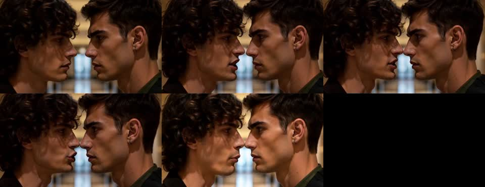
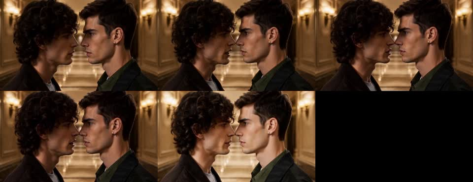

# MiniMax-H3 PDD current-revision GPU E2E

Runtime: [`b04bc33b3250`](https://github.com/LeslieWylie/vllm-omni/commit/b04bc33b3250b1cbd6bb28cbcbafc3abe54a3815), PR [#7425](https://github.com/vllm-project/vllm-omni/pull/7425).

A full-model Ref2VA HTTP integration smoke completed on September 13, 2026 (UTC+8). This records one sample and does not establish general model quality or dedicated-machine throughput.

## Configuration

- Four NVIDIA H20 GPUs, BF16, DiT TP4/USP1, text encoder TP4 with layer offload, VAE tile/patch parallel4, eager execution.
- vLLM 0.29.0, PyTorch 2.13.0+cu130. Runtime Python sources were compared with the PR revision and matched.
- An older service remained resident on the GPUs. Its processes were preserved; after this run the validation processes exited, GPU memory returned to its original inventory, and the old health endpoint returned 200.
- Same prompt, three references (two identities and a corridor), seed 42, requested 5 seconds at 832x480. The retained case prompt describes a longer scene; this reduced-duration sample is not a full narrative-quality test. Input reference assets are not redistributed here.
- Base: 28 sigma points / 27 NFE. PDD: published Ref2VA 8-step adapter, 9 sigma points / 8 NFE, scale 1.0. Video/audio shifts 12/3 for both.

## Results, in execution order

| Request | HTTP E2E seconds | Video |
| --- | ---: | --- |
| Base before PDD | 510.443 | [base_before.mp4](base_before.mp4) |
| First PDD, including adapter load | 227.266 | [pdd_first.mp4](pdd_first.mp4) |
| Base after PDD | 505.037 | [base_after.mp4](base_after.mp4) |
| Repeated PDD, cached adapter | 169.850 | [pdd_repeat.mp4](pdd_repeat.mp4) |

The last base/PDD pair is 2.973x for this single sample (66.37% less HTTP wall time). First-use costs are reported separately; these values are not latency guarantees.

All four responses returned HTTP 200 and passed full ffmpeg video/audio decoding. Each has 124 H.264 frames at 832x480, 5.166667 seconds of video, and stereo 32 kHz AAC at 5.175 seconds. See [manifest](manifest.json).

## Switching and quality limits

- Decoded RGB24 frames of base-before and base-after are byte-identical. This exercises the actual GPU request boundary without directly calling head-reset helpers.
- Repeated PDD decoded video and f32 audio are both byte-identical. See [comparison](repeat-comparison.json).
- Base audio is **not** byte-identical: decoded waveform relative L2 difference 0.0912195, max absolute difference 0.212605. Its cause was not isolated; this run does not establish baseline audio invariance or attribute the difference to PDD. See [audio difference](base-audio-difference.json).
- Sampled frames show coherent faces and a continuous two-person confrontation. This is a limited visual inspection, not an identity/action benchmark across cases.
- Whisper-small CPU transcription recognizes the intended sentence in both initial outputs but also returns additional text. Exact speech compliance is not established; the original audio is provided for listening.
- A 10-second 1344x768 attempt could not fit alongside the resident service. These smaller BF16 results must not be substituted for the old FP8/TP2/USP4 10-second measurements.

Base sampled frames:



PDD sampled frames:



## Reproduction profile

Use the pinned source and released MiniMax-H3 model/Ref2VA PDD artifact. Start an isolated service with:

```bash
CUDA_VISIBLE_DEVICES=0,1,2,3 \
PYTORCH_CUDA_ALLOC_CONF=expandable_segments:True \
VLLM_WORKER_MULTIPROC_METHOD=spawn \
VLLM_OMNI_VIDEO_SYNC_TIMEOUT=3600 \
vllm serve "$MODEL" --omni --host 127.0.0.1 --port 18020 \
  --task-type ref2va --num-gpus 4 --tensor-parallel-size 4 --usp 1 \
  --text-encoder-tp-size 4 --vae-patch-parallel-size 4 \
  --vae-parallel-mode tile --vae-use-tiling --enforce-eager \
  --diffusion-offload-config '{"mode":"layer","components":["text_encoder"]}' \
  --enable-lora --max-lora-rank 64 --diffusion-attention-backend FLASH_ATTN
```

Send the PDD recipe request with the same three references and prompt for each request, width 832, height 480, seconds 5, seed 42, video/audio shifts 12/3. Use 28 steps and omit `lora` for both base requests. Use 9 steps and the Ref2VA PDD file at scale 1 for both PDD requests. Execute base → PDD → base → PDD in one server process.
